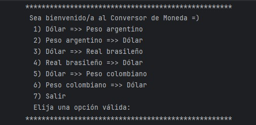
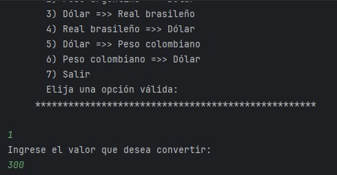
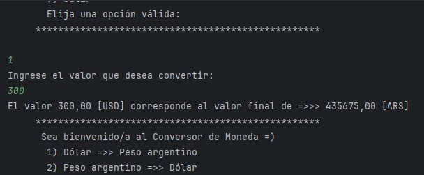

# Proyecto: Conversor de Monedas Java

  
  

Este proyecto consiste en la creación de un conversor de divisas interactivo programado en **Java**, utilizando programación orientada a objetos y consumo de datos externos.

> La aplicación permite al usuario seleccionar entre diversas opciones de cambio de moneda (Dólar, Peso Argentino, Real Brasileño, etc.) y obtener el valor convertido en tiempo real gracias a la integración con una API financiera.

> [!NOTE]
> **_El código refleja el proceso de aprendizaje en Java, enfocándose en el manejo de peticiones HTTP, el procesamiento de archivos JSON y la lógica de control por consola._**

En este proyecto se aplicaron conocimientos de backend, como el uso de clientes HTTP, la librería **Gson** para el mapeo de datos y estructuras de repetición para mantener una interfaz fluida.

---

  <ins><b>Lógica de Funcionamiento</b></ins>

### 1. Interfaz de Usuario (Consola)
Se implementó un menú interactivo utilizando un bucle `while` que permite realizar múltiples consultas hasta que el usuario decida salir mediante la opción 7.

### 2. Consumo de API y Datos
El programa se conecta a **ExchangeRate-API** para obtener tasas de cambio actuales. Los datos clave obtenidos son:
* `base_code`: Moneda de origen.
* `conversion_rates`: Un mapa de valores con todas las equivalencias disponibles.

### 3. Procesamiento Técnico
* **HttpClient**: Gestiona las peticiones de forma eficiente hacia el endpoint de la API.
* **Gson**: Librería encargada de transformar el JSON recibido en un `record` de Java.
* **Lógica de Conversión**: El método `realizarConversion` procesa el valor ingresado multiplicándolo por la tasa específica extraída del mapa.

---

  <ins><b>Mini Tutorial Visual</b></ins>

1. 
<i>Al iniciar, se despliega el menú de opciones. Debes digitalizar el número de la conversión que necesitas.</i>

  

2. 
<i>Luego, el sistema solicitará que ingreses el monto que deseas convertir.</i>

  

3. 
<i>Finalmente, obtendrás el resultado formateado con dos decimales, indicando las siglas de las monedas involucradas.</i>

  

---

  <b>Con esto finalizo la documentación de mi segundo desafío en el curso.</b>

  